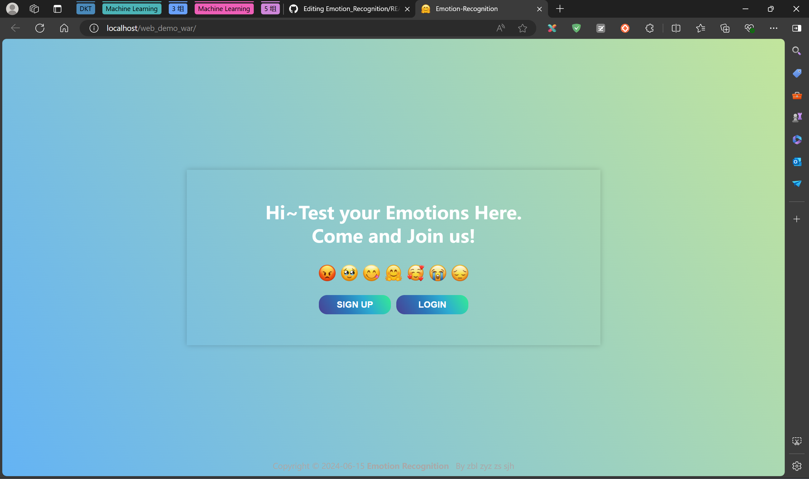
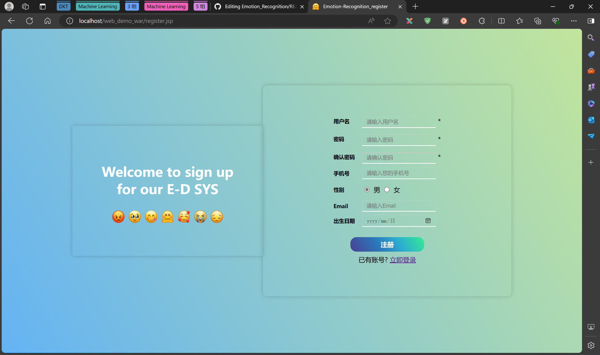
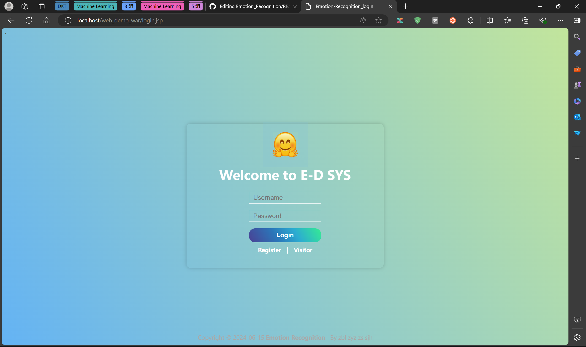
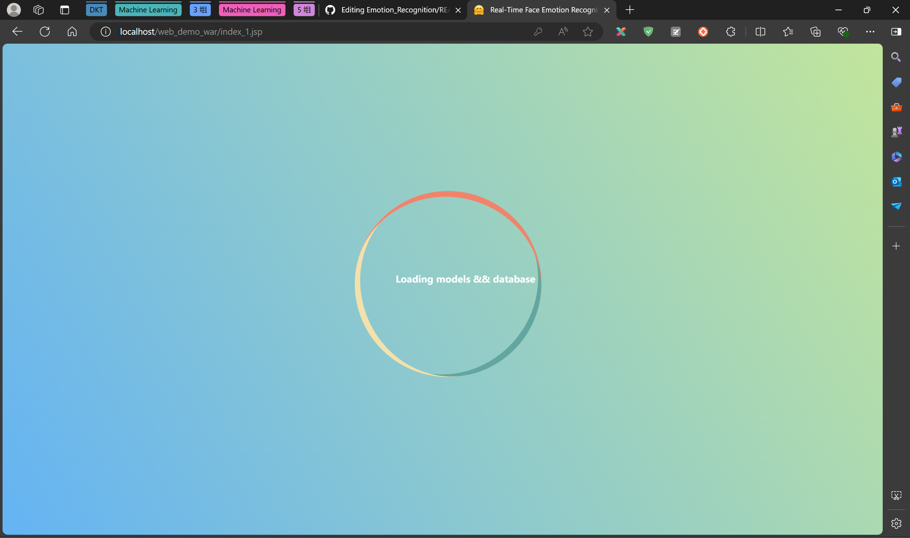
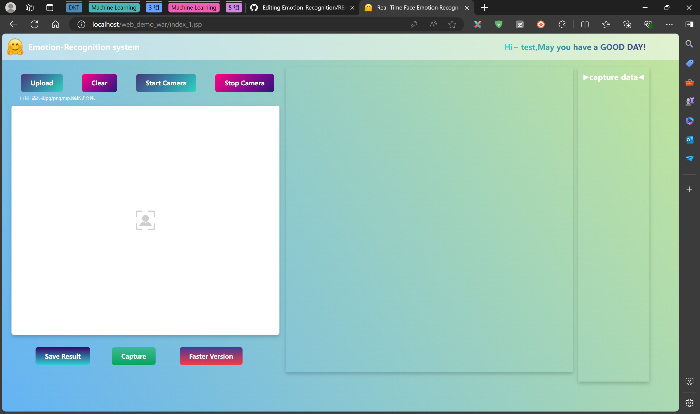
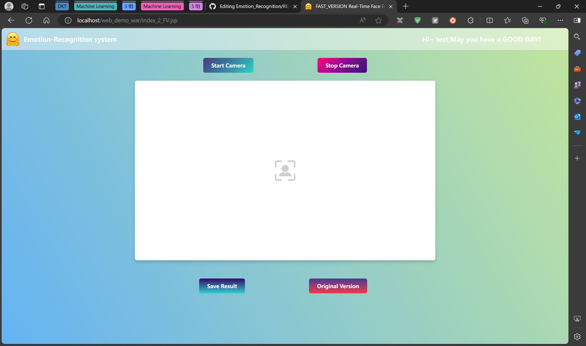
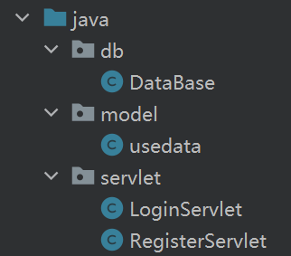
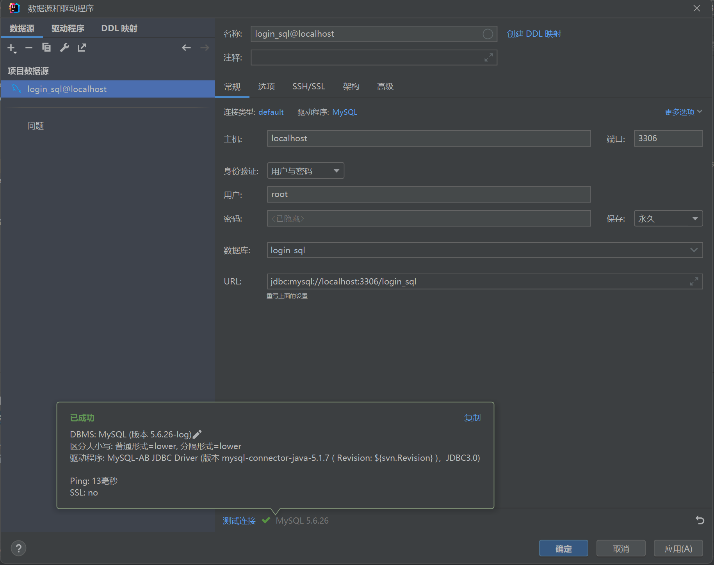
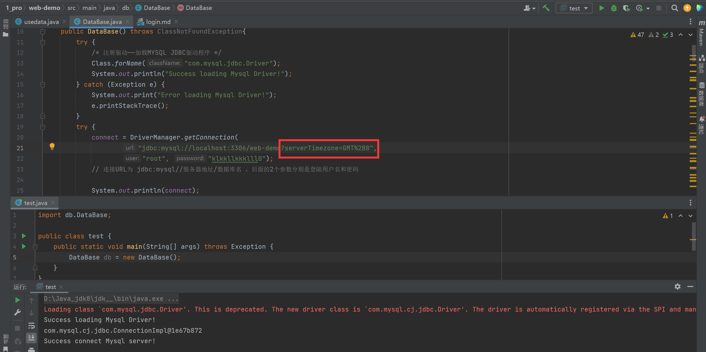
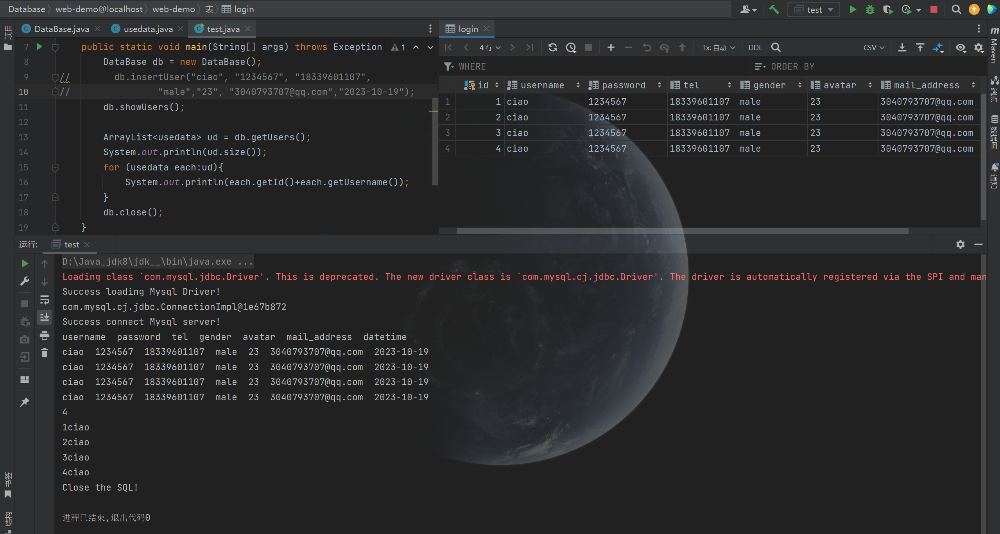

#  Emotion Recognition System

## ★界面介绍  

- `index.jsp`首页（选择登录、注册）
- `register.jsp`注册
- `login.jsp`登录页面——【用户登录JS校验】获取两次输入的密码，判断密码是否一致
- `index_1.jsp`人脸识别界面
- `index_2_FV.jsp`人脸识别极速版  

## ★界面演示  

主页  
   
注册登录界面  
   
加载动画  
  
实用界面与极速版  
  

## ★后端
  

### *MySQL*
- `login_sql`  

*jdbc:mysql://localhost:3306/login_sql*  

|             |    MySQL     |    JDBC     |  
|-------------|:------------:|:-----------:|
| **version** |  **5.6.26**  |  **5.1.7**  |

### 测试阶段  
添加数据库时区  

数据库增、查功能测试  

